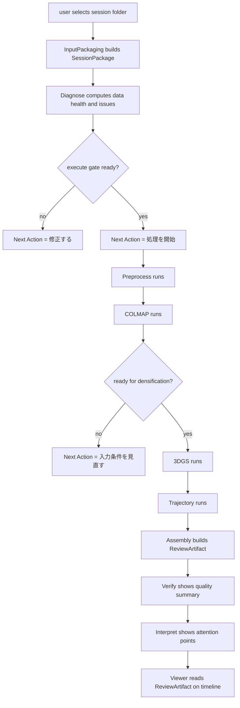

# BDD リリースコンパス

この文書は、`prj-reviework` の user value、core story、terminal behavior、release line の対応をまとめる。

## ノーススター

user は `Next Action` を 1 件だけ受け取り、`Thin Status` で処理状態と理由を薄く常時把握しながら、reconstruction pipeline の intake から review 判断まで迷わず進められる。

## 提供方針

- `Timeline` を統合キーとして先に固定する
- heavy pipeline より前に、diagnose と execute gate を先に成立させる
- `Next Action` の一意性を崩さずに、異常理由だけを `Thin Status` へ薄く出す
- `iSensorium` 由来資産は `prj-reviework` 配下へコピーしたうえで専用調整する

## コアストーリー

1. user は session folder を投入して、review 対象として受理できる
2. user は diagnose phase で不足入力と品質低下の理由を読める
3. user は実行可能になったときだけ `処理を開始` を提示される
4. user は run phase で `完了を待つ` と現在ステップだけを見ればよい
5. user は `COLMAP` failure 時に `入力条件を見直す` へ迷わず戻れる
6. user は verify phase で空間品質と軌跡品質の弱点を把握できる
7. user は interpret phase で review すべき区間だけを絞り込める
8. user は uncertainty を伴う relink を理由付きで把握できる
9. user は `ReviewArtifact` を read-only viewer で timeline 同期確認できる
10. operator は `iSensorium` 由来 parser 資産を互換維持したまま `reviework` 内で独立運用できる
11. operator は shared 参照を残さず、`prj-reviework` 単独で build / test / docs を更新できる
12. operator は test output と trial data を正しい category に分離できる

## 対応ルール

- gate closeout 記録は `mrl-record.md` を追加した時点でそこへ集約する
- TDD 計画は `tdd-test-matrix.md` に記録する
- ongoing の確認事項は `--devs/--state/prj-reviework/current_state.md` に追記する

## シーケンス

## terminal behaviors

- `B1`: session folder が受理されると、`SessionPackage` に required / optional input の充足状況が反映される
- `B2`: diagnose phase は、欠落入力、低品質、修正理由を `Thin Status` で返す
- `B3`: execute gate は、`preprocess`、`COLMAP`、`3DGS`、`trajectory` の readiness を満たしたときだけ `処理を開始` を返す
- `B4`: run phase は、`Next Action` を常に `完了を待つ` 1 件に保ち、現在ステップを別 line で返す
- `B5`: `COLMAP` が densification 不可なら、`3DGS` を開始せず `入力条件を見直す` へ戻す
- `B6`: verify phase は `space` と `trajectory` の quality を同時に返し、弱点を issue 化する
- `B7`: interpret phase は attention point を時間範囲と理由付きで返す
- `B8`: relink は visual match confidence、time gap、anchor proximity の 3 条件で判定し、不成立時は uncertainty を上げる
- `B9`: `Assembly` は唯一の `ReviewArtifact` 生成者であり、`Viewer` は read-only 消費だけを行う
- `B10`: parser は `bt.jsonl` / `poses.jsonl` と `ble_scan.jsonl` / `arcore_pose.jsonl` の両方を受理する
- `B11`: `reviework` の products は `prj-reviework` 配下だけで完結し、`iSensorium` の package / file を shared 参照しない
- `B12`: test logs と trial data は `--process/--testlogs/prj-reviework/` と `--trial-data/prj-reviework/` に分離される

## 受け入れ基準

| behavior_id | 観点 | 受け入れ基準 |
| --- | --- | --- |
| `B1` | input packaging | `frames`、`imu`、`bt`、optional `poses` / `gnss` の充足状況が読める |
| `B2` | diagnose UX | 欠落入力と品質低下理由が `Thin Status` の 5 カテゴリで読める |
| `B3` | execute gate | readiness 未達時は `処理を開始` を返さない |
| `B4` | run UX | `Next Action` は 1 件だけで、現在ステップは補足 line に分離される |
| `B5` | pipeline safety | `COLMAP` failure 時に `3DGS` を開始しない |
| `B6` | verify UX | `space` と `trajectory` の quality が同時に示される |
| `B7` | interpret UX | attention point に時間範囲と理由が入る |
| `B8` | trajectory uncertainty | relink 判定が 3 条件に基づき uncertainty を更新する |
| `B9` | artifact boundary | `ReviewArtifact` の生成責務が `Assembly` に限定される |
| `B10` | reuse compatibility | legacy alias と reviework alias の両方を parser が読める |
| `B11` | copy boundary | `prj-reviework` 単独で docs / test / build が継続できる |
| `B12` | output hygiene | build cache と test output が source-of-truth products に残らない |

## MRL 対応表

### MRL-1 intake and diagnose foundation

- user stories: `1`, `2`, `3`
- current gate: `active`

#### mRL-1.1 SessionPackage intake contract

- `B1`、`B10` を成立させる
- gate: `pass`

#### mRL-1.2 Thin Status diagnose baseline

- `B2` を成立させる
- gate: `pass`

#### mRL-1.3 execute readiness gate

- `B3` を成立させる
- gate: `planned`

### MRL-2 pipeline run orchestration

- user stories: `4`, `5`
- current gate: `planned`

#### mRL-2.1 single-action run UX

- `B4` を成立させる
- gate: `pass`

#### mRL-2.2 COLMAP to 3DGS gate

- `B5` を成立させる
- gate: `planned`

#### mRL-2.3 blocking issue return path

- `B2`、`B5` の往復を成立させる
- gate: `planned`

### MRL-3 verify and interpret artifact line

- user stories: `6`, `7`, `8`, `9`
- current gate: `planned`

#### mRL-3.1 quality summary contract

- `B6` を成立させる
- gate: `planned`

#### mRL-3.2 attention point synthesis

- `B7`、`B8` を成立させる
- gate: `planned`

#### mRL-3.3 ReviewArtifact and viewer boundary

- `B9` を成立させる
- gate: `planned`

### MRL-4 reuse and operations hardening

- user stories: `10`, `11`, `12`
- current gate: `pass`

#### mRL-4.1 parser compatibility copy

- `B10` を成立させる
- gate: `pass`

#### mRL-4.2 independent project boundary

- `B11` を成立させる
- gate: `pass`

#### mRL-4.3 output routing hygiene

- `B12` を成立させる
- gate: `pass`
