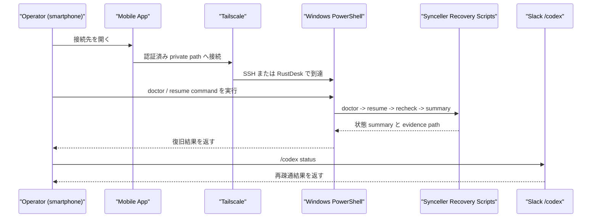

# Remote Recovery BDD

## Story Summary

operator は外出先で smartphone から Windows PC に入り、`Synceller` と `Slack` の接続状態を診断し、必要なら復旧 command を実行して Codex 開発継続に戻したい。

## Scenario A: 主系統で shell 復旧する

### Experience

smartphone しか手元にない状態で、Slack の `/codex` が反応しない。operator は別系統から Windows に入り、短い手順で復旧し、再び Slack から Codex を使いたい。

### Touchpoints

- iPhone または Android
- `Tailscale`
- SSH client
- Windows `PowerShell`
- `doctor` / `resume` script
- Slack 上の `/codex status`

### Value

- 外出先でも数手で復旧できる
- 何が死んでいたかを判断できる
- 復旧後に Slack から開発継続へ戻れる

### Function Elements

- mobile から Windows shell へ接続する
- `doctor` command を実行する
- `resume -> recheck -> summary` を順番に実行する
- 結果 summary と evidence を残す

### Technology Elements

- `Tailscale`
- `OpenSSH Server`
- `PowerShell`
- recovery script
- `Synceller` 診断 script

## Scenario B: 副系統で GUI fallback する

### Experience

主系統で shell に入れない、または GUI 操作で service 状態を確認したい。operator は GUI fallback を使って Windows に入り、同じ recovery contract を実行したい。

### Touchpoints

- iPhone または Android
- `Tailscale`
- `RustDesk`
- Windows desktop
- 同一の recovery script

### Value

- 主系統が使えなくても復旧の打ち手を失わない
- shell と GUI で別々の復旧手順を持たずに済む

### Function Elements

- GUI で Windows に到達する
- shell fallback と同じ script を呼ぶ
- 失敗時の次の判断を出す

### Technology Elements

- `RustDesk`
- `Tailscale`
- Windows desktop session
- recovery script

## Scenario C: GUI launcher で迷わず復旧する

### Experience

operator は GUI fallback で Windows に入れたが、長い command を打ちたくない。operator は desktop 上の launcher icon を押して `doctor` や `resume` を起動し、誤操作なく recovery を進めたい。

### Touchpoints

- `RustDesk`
- Windows desktop
- launcher icon / shortcut
- Windows `PowerShell`
- `doctor` / `resume` / `recover preview`

### Value

- command を覚えなくても recovery を進められる
- 非エンジニアでも押しやすい
- GUI fallback の操作ミスを減らせる

### Function Elements

- GUI 上で launcher を押す
- launcher が同じ recovery script を呼ぶ
- read 系と action 系の launcher を分ける

### Technology Elements

- `RustDesk`
- Windows shortcut
- PowerShell launcher script

## Sequence

## Behavior Leaves

- `B1`
  operator は iPhone または Android から Windows へ private path で到達できる
- `B2`
  主系統では mobile から `PowerShell` shell を直接開ける
- `B3`
  主系統の 1 command で `doctor` 相当の状態診断を返せる
- `B4`
  主系統の 1 command で `resume` を安全順序で実行できる
- `B5`
  主系統の実行結果は evidence path と次の判断を返せる
- `B6`
  副系統では GUI から同じ recovery script を実行できる
- `B7`
  operator は主系統と副系統の切替条件を判断できる
- `B8`
  復旧後、Slack の `/codex status` で再疎通確認できる
- `B9`
  GUI fallback では launcher icon から `doctor` / `resume` / `recover preview` を起動できる

## Acceptance Criteria

| behavior_id | acceptance criteria |
| --- | --- |
| `B1` | iPhone と Android の両方に到達手順と認証前提が定義されている |
| `B2` | smartphone から Windows `PowerShell` を既定 shell として開ける |
| `B3` | 診断 command が `Slack`、`Docker`、`PostgreSQL`、`Synceller`、`app-server` の状態を返す |
| `B4` | 復旧 command が安全順序で再起動と再確認を行う |
| `B5` | 実行結果に evidence path と手動介入要否が含まれる |
| `B6` | GUI fallback でも shell と同じ復旧 command を起動できる |
| `B7` | 主系統優先、副系統移行の判断条件が runbook に明記されている |
| `B8` | 復旧完了後の `/codex status` 確認が UX と evidence に含まれる |
| `B9` | GUI launcher が主系統と同じ recovery contract を呼び、read 系と action 系の役割が分かれている |
