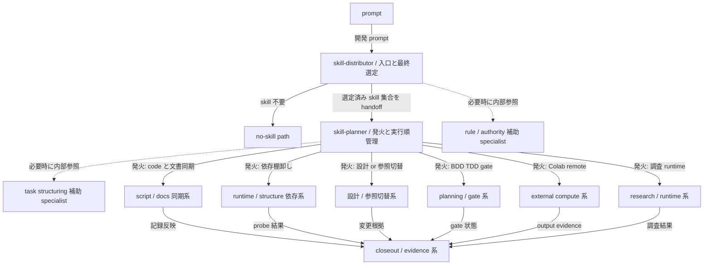
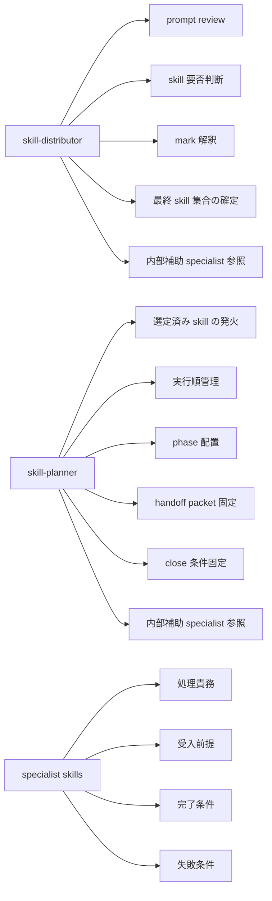
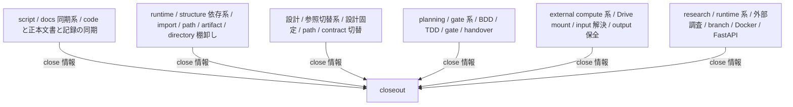
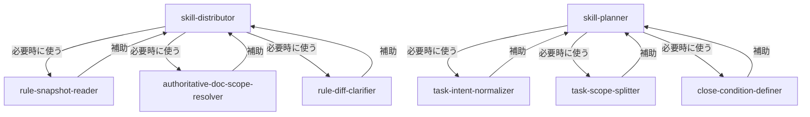
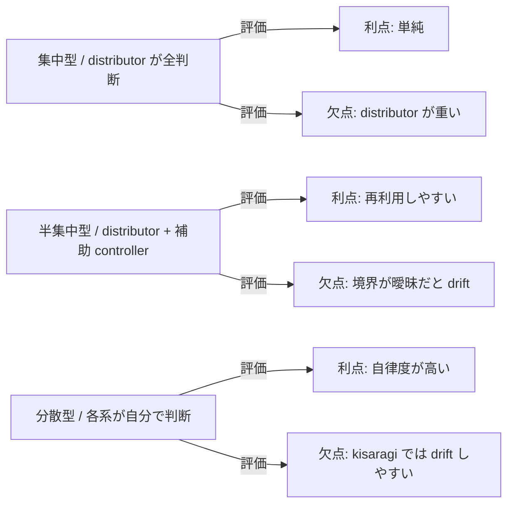
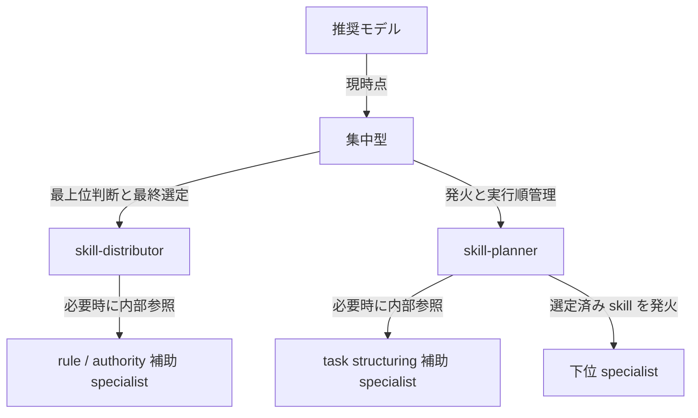
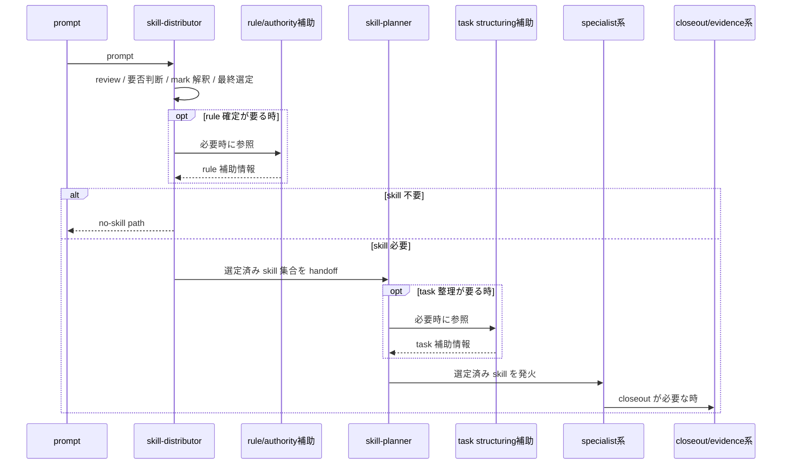
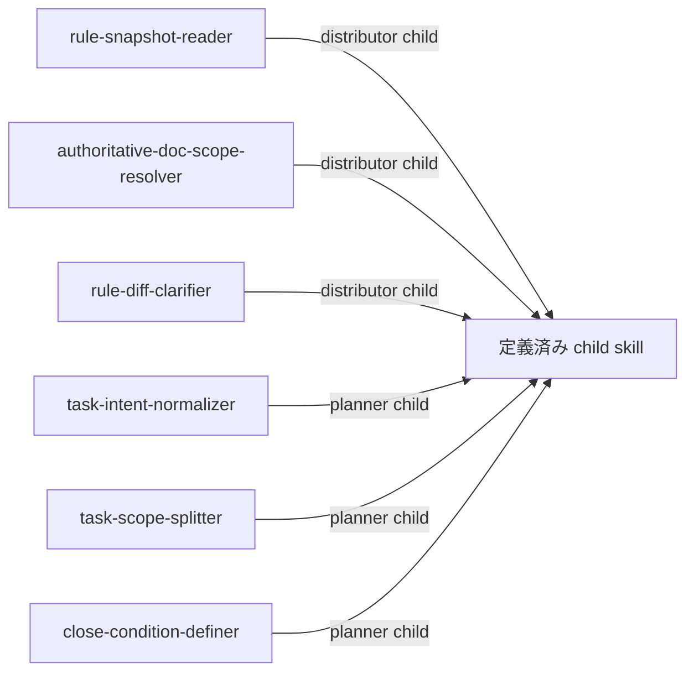

# kisaragi skill trigger system map

## 目的

- `prompt -> skill-distributor -> skill-planner -> specialist` の主線を図で固定する。
- `rule / authority` と `task structuring` は独立した `系` ではなく、distributor / planner が必要時に参照する内部補助 specialist として扱う。
- trigger ownership、発火と実行順管理 owner、specialist の役割境界を図で読めるようにする。

## 全体構造

## ownership map

## distributor / planner 配下の推奨 tree

```mermaid
flowchart TD
    D["skill-distributor"]
    D -->|内部補助 specialist| RA["rule / authority 補助 specialist"]
    D -->|選定済み集合を渡す| P["skill-planner"]

    RA -->|最新 rule| RA1["rule-snapshot-reader"]
    RA -->|管理文書範囲| RA2["authoritative-doc-scope-resolver"]
    RA -->|rule 差分| RA3["rule-diff-clarifier"]

    P -->|内部補助 specialist| TS["task structuring 補助 specialist"]
    P -->|同期系を発火| SD["script / docs 同期系"]
    P -->|依存系を発火| RT["runtime / structure 依存系"]
    P -->|設計系を発火| DR["設計 / 参照切替系"]
    P -->|planning 系を発火| PG["planning / gate 系"]
    P -->|external 系を発火| EC["external compute 系"]
    P -->|research 系を発火| RR["research / runtime 系"]
    P -->|closeout 系を発火| CE["closeout / evidence 系"]

    TS -->|intent 正規化| TS1["task-intent-normalizer"]
    TS -->|task 分割| TS2["task-scope-splitter"]
    TS -->|close 条件| TS3["close-condition-definer"]

    SD -->|code docs test 記録| SD1["script-doc-sync-enforcer"]
    SD -->|docs drift| SD2["documentation-watchkeeper"]
    SD -->|更新先特定| SD3["doc-target-resolver"]
    SD -->|evidence 記録| SD4["test-and-evidence-recorder"]

    RT -->|依存棚卸し| RT1["runtime-structure-dependency-mapper"]
    RT -->|handoff 整理| RT2["artifact-handoff-mapper"]
    RT -->|path 契約| RT3["path-contract-scanner"]

    DR -->|設計固定| DR1["design-first-script-builder"]
    DR -->|参照切替| DR2["reference-rewire-operator"]
    DR -->|phase 化| DR3["phase-task-orchestrator"]

    PG -->|BDD TDD gate| PG1["delivery-planning-keeper"]

    EC -->|output 保全| EC1["external-compute-output-keeper"]
    EC -->|Drive input| EC2["drive-input-bootstrap-checker"]
    EC -->|bootstrap 範囲| EC3["runtime-bootstrap-scope-resolver"]

    RR -->|外部調査| RR1["frontier-research-curator"]
    RR -->|runtime 安定化| RR2["runtime-operator"]

    CE -->|記録先確定| CE1["evidence-destination-resolver"]
    CE -->|log 昇格抽出| CE2["log-promotable-facts-extractor"]
```

## 主な specialist 系の役割

## 内部補助 specialist の位置づけ

## モデル比較

## 現時点の推奨

## 発火順の標準

## 定義済み child skill

